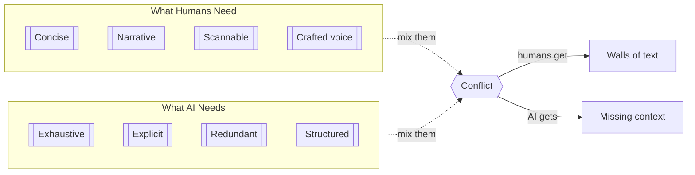
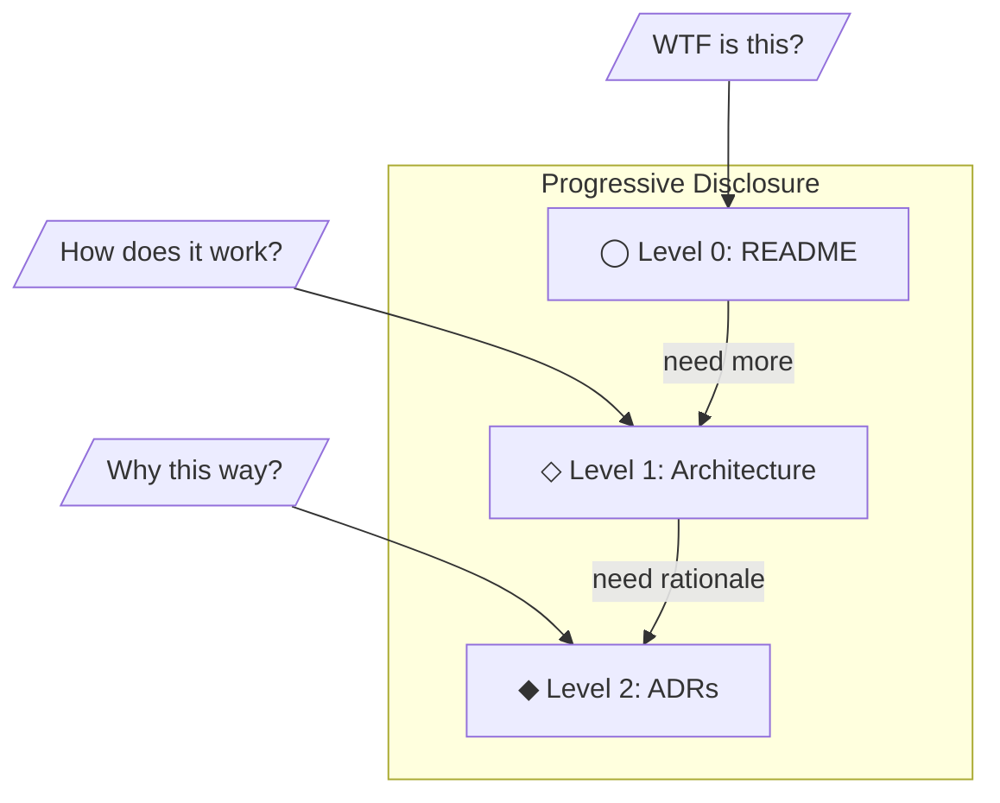

<!-- doc-audience: human, preserve-voice -->

# Why ai-human-docs Exists

## The Problem

AI-generated documentation is overwhelming human cognitive ability.

AI coding agents need verbose, explicit, redundant context to work effectively. Every edge case documented. Every assumption spelled out. Every interaction explained in exhaustive detail.

But humans can't skim 500 lines to find the one thing they need. They give up. They stop reading. The documentation becomes write-only.

## The Core Tension



**These needs are fundamentally incompatible in a single document.**

## The Cost of Mixing

When you try to serve both audiences in one doc:

| Who | What Happens |
|-----|--------------|
| **Humans** | Stop reading. Critical info gets buried. Onboarding fails. |
| **AI agents** | Miss context anyway. Make mistakes from gaps in tribal knowledge. |
| **Teams** | Lose trust in docs. Stop maintaining them. |

## The Bento Box Model

Think of your documentation as a bento box: separate compartments for different purposes, not a single mixed dish.

| Layer | Audience | Traits |
|-------|----------|--------|
| **Orientation** | Senior engineers | concise, narrative, curated |
| **Deep Design** | Architects | ADRs, rationales, diagrams |
| **Grounding** | AI agents | exhaustive, verbose, explicit |
| **Context Sync** | Automation | updateable, structured |

## The Failed Approaches

### "Write verbose docs"
Humans stop reading after the first screen. Critical information gets buried. New team members are overwhelmed.

### "Write concise docs"
AI agents miss context. They make mistakes because they didn't know about that one edge case buried in someone's memory.

### "Let AI improve the docs"
AI expands your crisp 10-line quickstart into a 200-line wall of text. It adds helpful context. It documents edge cases. It destroys the voice. No human will ever read it again.

## The Solution

**Split your documentation by audience. Tag each file. AI respects the tags.**

```
docs/
├── human/          # Crafted for humans, AI hands off
│   ├── quickstart.md       # 2-minute read
│   └── architecture.md     # The big picture
└── ai/             # Verbose reference, AI can edit freely
    ├── api-reference.md    # Every endpoint, every field
    └── schema-guide.md     # All the edge cases
```

The human docs stay concise. The AI docs stay comprehensive. Both audiences get what they need.

## Progressive Disclosure for Humans

Human documentation should follow a three-level structure:



**Key:** Humans start at Level 0 and drill down only when needed. Each level answers a different question.

## The Tags

```html
<!-- doc-audience: human, preserve-voice -->
```

This single line tells AI agents: **hands off**. Don't edit. Don't expand. Don't "improve." This document was crafted for human readers and you will respect that.

```html
<!-- doc-audience: ai -->
```

This tells AI agents: **go wild**. Be verbose. Add context. Document edge cases. This is your space.

## Why HTML Comments?

1. **Invisible in rendered markdown** — GitHub, GitLab, and most renderers hide HTML comments
2. **No ugly tables** — Unlike YAML frontmatter, comments don't render as visible metadata
3. **Universal support** — Works in any markdown file, any renderer
4. **Easy to parse** — Simple regex, no YAML parser needed

## The Cultural Shift

This isn't just about tags. It's about recognizing that:

1. **Documentation has audiences** — Stop pretending one doc serves everyone
2. **AI and humans read differently** — Optimize for each
3. **Voice matters** — Human docs should be pleasant to read
4. **Boundaries are healthy** — AI needs permission, not just capability

The core principles:

- Human docs = **crafted communication**
- AI docs = **machine legibility infrastructure**
- Do not try to make 1 doc serve both
- Protect narrative documents aggressively
- Default to less text in human docs
- Default to more explicitness in AI docs

## Getting Started

Add this to your CLAUDE.md or AGENTS.md:

```markdown
Before editing any file, check for `<!-- doc-audience: ... -->` on line 1.
If `preserve-voice`, do NOT edit, expand, or rephrase.

See https://github.com/modern-tooling/ai-human-docs for full specification.
```

Then tag your human docs:

```html
<!-- doc-audience: human, preserve-voice -->
```

That's it. Your human docs are protected.
